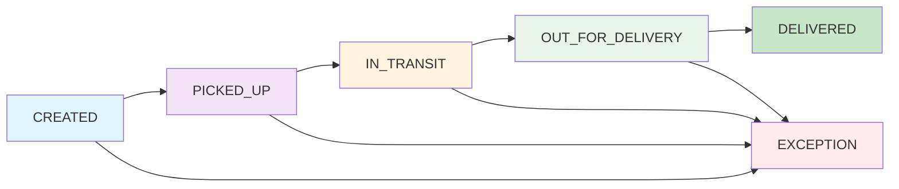

# Documentación de APIs - Coordinadora Tracking API

## 🚀 Introducción

La API de Coordinadora Tracking proporciona endpoints para el registro y consulta de checkpoints de unidades de envío, implementando Clean Architecture con Flask y siguiendo las mejores prácticas de REST.

## 🔐 Autenticación

### API Key Authentication

Todas las requests requieren autenticación mediante API Key en el header:

```http
X-API-Key: test-api-key
```

**Ejemplo de uso:**
```bash
curl -H "X-API-Key: test-api-key" \
  http://localhost:8000/api/v1/tracking/TEST123456
```

## 📋 Endpoints Disponibles

### 1. Registrar Checkpoint

**Endpoint**: `POST /api/v1/checkpoints`

**Descripción**: Registra un nuevo checkpoint para una unidad de tracking.

#### Request Body

```json
{
  "tracking_id": "string",
  "status": "string",
  "location": "string",
  "description": "string",
  "timestamp": "string (ISO 8601)"
}
```

#### Parámetros

| Campo | Tipo | Requerido | Descripción | Ejemplo |
|-------|------|-----------|-------------|---------|
| `tracking_id` | string | ✅ | ID único de tracking (min 6 caracteres) | `"TEST123456"` |
| `status` | string | ✅ | Estado de la unidad | `"CREATED"`, `"PICKED_UP"`, `"IN_TRANSIT"`, `"OUT_FOR_DELIVERY"`, `"DELIVERED"`, `"EXCEPTION"` |
| `location` | string | ✅ | Ubicación del checkpoint | `"Bogotá, Colombia"` |
| `description` | string | ✅ | Descripción del evento | `"Paquete recogido"` |
| `timestamp` | string | ✅ | Fecha y hora en formato ISO 8601 | `"2024-01-15T10:30:00Z"` |

#### Estados Válidos

```json
{
  "valid_statuses": [
    "CREATED",
    "PICKED_UP", 
    "IN_TRANSIT",
    "OUT_FOR_DELIVERY",
    "DELIVERED",
    "EXCEPTION"
  ]
}
```

#### Ejemplo de Request

```bash
curl -X POST http://localhost:8000/api/v1/checkpoints \
  -H "Content-Type: application/json" \
  -H "X-API-Key: test-api-key" \
  -d '{
    "tracking_id": "TEST123456",
    "status": "PICKED_UP",
    "location": "Medellín, Colombia",
    "description": "Paquete recogido del almacén",
    "timestamp": "2024-01-15T11:30:00Z"
  }'
```

#### Response Success (201 Created)

```json
{
  "success": true,
  "message": "Checkpoint registrado exitosamente",
  "data": {
    "tracking_id": "TEST123456",
    "checkpoint_id": "uuid-generated",
    "status": "PICKED_UP",
    "location": "Medellín, Colombia",
    "description": "Paquete recogido del almacén",
    "timestamp": "2024-01-15T11:30:00Z",
    "unit_created": false
  }
}
```

#### Response Errors

**400 Bad Request - Validation Error:**
```json
{
  "error": "validation_error",
  "message": "Error de validación en los datos",
  "details": {
    "tracking_id": ["Tracking ID debe tener al menos 6 caracteres"],
    "status": ["Estado inválido"]
  }
}
```

**401 Unauthorized - Invalid API Key:**
```json
{
  "error": "invalid_api_key",
  "message": "API Key inválida o faltante"
}
```

**500 Internal Server Error:**
```json
{
  "error": "internal_error",
  "message": "Error interno del servidor"
}
```

---

### 2. Consultar Historial de Tracking

**Endpoint**: `GET /api/v1/tracking/{trackingId}`

**Descripción**: Obtiene el historial completo de checkpoints para una unidad específica.

#### Parámetros de URL

| Parámetro | Tipo | Requerido | Descripción |
|-----------|------|-----------|-------------|
| `trackingId` | string | ✅ | ID de tracking a consultar |

#### Ejemplo de Request

```bash
curl -H "X-API-Key: test-api-key" \
  http://localhost:8000/api/v1/tracking/TEST123456
```

#### Response Success (200 OK)

```json
{
  "success": true,
  "tracking_id": "TEST123456",
  "current_status": "IN_TRANSIT",
  "delivery_time": "2024-01-16T15:30:00Z",
  "checkpoints": [
    {
      "id": "uuid-1",
      "status": "CREATED",
      "location": "Bogotá, Colombia",
      "description": "Paquete creado",
      "timestamp": "2024-01-15T10:30:00Z"
    },
    {
      "id": "uuid-2", 
      "status": "PICKED_UP",
      "location": "Medellín, Colombia",
      "description": "Paquete recogido",
      "timestamp": "2024-01-15T11:30:00Z"
    },
    {
      "id": "uuid-3",
      "status": "IN_TRANSIT", 
      "location": "Centro de Distribución",
      "description": "En tránsito",
      "timestamp": "2024-01-15T14:00:00Z"
    }
  ],
  "total_checkpoints": 3,
  "created_at": "2024-01-15T10:30:00Z",
  "updated_at": "2024-01-15T14:00:00Z"
}
```

#### Response Errors

**404 Not Found:**
```json
{
  "error": "tracking_not_found",
  "message": "Tracking ID no encontrado"
}
```

---

### 3. Listar Unidades por Estado

**Endpoint**: `GET /api/v1/shipments`

**Descripción**: Lista todas las unidades filtradas por estado.

#### Query Parameters

| Parámetro | Tipo | Requerido | Descripción | Valores Válidos |
|-----------|------|-----------|-------------|-----------------|
| `status` | string | ❌ | Filtrar por estado | `CREATED`, `PICKED_UP`, `IN_TRANSIT`, `OUT_FOR_DELIVERY`, `DELIVERED`, `EXCEPTION` |
| `limit` | integer | ❌ | Límite de resultados | `1-100` (default: 50) |
| `offset` | integer | ❌ | Desplazamiento para paginación | `0+` (default: 0) |

#### Ejemplo de Request

```bash
# Listar todas las unidades en tránsito
curl -H "X-API-Key: test-api-key" \
  "http://localhost:8000/api/v1/shipments?status=IN_TRANSIT"

# Con paginación
curl -H "X-API-Key: test-api-key" \
  "http://localhost:8000/api/v1/shipments?status=CREATED&limit=10&offset=20"
```

#### Response Success (200 OK)

```json
{
  "success": true,
  "units": [
    {
      "id": "uuid-1",
      "tracking_id": "TEST123456",
      "status": "IN_TRANSIT",
      "location": "Centro de Distribución",
      "delivery_time": "2024-01-16T15:30:00Z",
      "total_checkpoints": 3,
      "created_at": "2024-01-15T10:30:00Z",
      "updated_at": "2024-01-15T14:00:00Z"
    },
    {
      "id": "uuid-2", 
      "tracking_id": "TEST789012",
      "status": "IN_TRANSIT",
      "location": "Centro de Distribución",
      "delivery_time": "2024-01-17T10:00:00Z",
      "total_checkpoints": 2,
      "created_at": "2024-01-15T11:00:00Z",
      "updated_at": "2024-01-15T13:30:00Z"
    }
  ],
  "pagination": {
    "total": 2,
    "limit": 50,
    "offset": 0,
    "has_more": false
  },
  "filters": {
    "status": "IN_TRANSIT"
  }
}
```

#### Response Errors

**400 Bad Request - Invalid Status:**
```json
{
  "error": "validation_error",
  "message": "Estado inválido",
  "details": {
    "status": ["Estado debe ser uno de: CREATED, PICKED_UP, IN_TRANSIT, OUT_FOR_DELIVERY, DELIVERED, EXCEPTION"]
  }
}
```

---

## 🔧 Endpoints de Monitoreo

### Health Check

**Endpoint**: `GET /health`

**Descripción**: Verifica el estado de salud de la API y sus dependencias.

```bash
curl http://localhost:8000/health
```

**Response:**
```json
{
  "status": "healthy",
  "timestamp": "2024-01-15T15:30:00Z",
  "services": {
    "database": "healthy",
    "redis": "healthy",
    "celery": "healthy"
  }
}
```

### Métricas de Negocio

**Endpoint**: `GET /metrics/business`

**Descripción**: Obtiene métricas de negocio del sistema.

```bash
curl -H "X-API-Key: test-api-key" \
  http://localhost:8000/metrics/business
```

**Response:**
```json
{
  "total_units": 150,
  "units_by_status": {
    "CREATED": 25,
    "PICKED_UP": 40,
    "IN_TRANSIT": 60,
    "OUT_FOR_DELIVERY": 15,
    "DELIVERED": 8,
    "EXCEPTION": 2
  },
  "total_checkpoints": 450,
  "avg_delivery_time": "2.5 days"
}
```

### Estado de Celery

**Endpoint**: `GET /api/v1/celery/status`

**Descripción**: Monitorea el estado de los workers de Celery.

```bash
curl -H "X-API-Key: test-api-key" \
  http://localhost:8000/api/v1/celery/status
```

**Response:**
```json
{
  "active_workers": 2,
  "registered_tasks": [
    "process_checkpoint",
    "send_notification",
    "cleanup_old_data"
  ],
  "active_tasks": 3,
  "queued_tasks": 5
}
```

---

## 🔄 Flujo de Estados

### Transiciones Válidas



### Reglas de Negocio

1. **Estado Inicial**: Todas las unidades comienzan en `CREATED`
2. **Transiciones Secuenciales**: Los estados deben seguir el flujo definido
3. **Excepciones**: Cualquier estado puede cambiar a `EXCEPTION`
4. **Finalización**: Solo `DELIVERED` y `EXCEPTION` son estados finales
5. **Inmutabilidad**: Los checkpoints no pueden ser modificados una vez creados

---

## 🚨 Códigos de Error

### Códigos HTTP

| Código | Descripción | Cuándo Ocurre |
|--------|-------------|---------------|
| `200` | OK | Request exitoso |
| `201` | Created | Recurso creado exitosamente |
| `400` | Bad Request | Datos de entrada inválidos |
| `401` | Unauthorized | API Key inválida o faltante |
| `404` | Not Found | Recurso no encontrado |
| `429` | Too Many Requests | Rate limit excedido |
| `500` | Internal Server Error | Error interno del servidor |

### Códigos de Error Personalizados

| Error Code | Descripción |
|------------|-------------|
| `validation_error` | Error en validación de datos |
| `invalid_api_key` | API Key inválida |
| `tracking_not_found` | Tracking ID no existe |
| `business_error` | Violación de reglas de negocio |
| `internal_error` | Error interno del sistema |

---

## 📝 Ejemplos de Uso Completos

### Escenario 1: Nuevo Envío

```bash
# 1. Crear unidad con estado inicial
curl -X POST http://localhost:8000/api/v1/checkpoints \
  -H "Content-Type: application/json" \
  -H "X-API-Key: test-api-key" \
  -d '{
    "tracking_id": "NEW123456",
    "status": "CREATED",
    "location": "Bogotá, Colombia",
    "description": "Paquete creado en sistema",
    "timestamp": "2024-01-15T09:00:00Z"
  }'

# 2. Actualizar a recogido
curl -X POST http://localhost:8000/api/v1/checkpoints \
  -H "Content-Type: application/json" \
  -H "X-API-Key: test-api-key" \
  -d '{
    "tracking_id": "NEW123456",
    "status": "PICKED_UP",
    "location": "Almacén Central, Bogotá",
    "description": "Paquete recogido para envío",
    "timestamp": "2024-01-15T10:30:00Z"
  }'

# 3. Consultar historial
curl -H "X-API-Key: test-api-key" \
  http://localhost:8000/api/v1/tracking/NEW123456
```

### Escenario 2: Consulta de Estado

```bash
# Listar todas las unidades en tránsito
curl -H "X-API-Key: test-api-key" \
  "http://localhost:8000/api/v1/shipments?status=IN_TRANSIT"

# Verificar salud del sistema
curl http://localhost:8000/health
```

### Escenario 3: Manejo de Errores

```bash
# Error: API Key inválida
curl -X POST http://localhost:8000/api/v1/checkpoints \
  -H "Content-Type: application/json" \
  -H "X-API-Key: invalid-key" \
  -d '{"tracking_id": "TEST123", "status": "CREATED", "location": "Test", "description": "Test", "timestamp": "2024-01-15T10:30:00Z"}'

# Error: Datos inválidos
curl -X POST http://localhost:8000/api/v1/checkpoints \
  -H "Content-Type: application/json" \
  -H "X-API-Key: test-api-key" \
  -d '{"tracking_id": "123", "status": "INVALID", "location": "", "description": "", "timestamp": "invalid-date"}'

# Error: Tracking no encontrado
curl -H "X-API-Key: test-api-key" \
  http://localhost:8000/api/v1/tracking/NONEXISTENT123
```

---

## 🔧 Configuración y Variables de Entorno

### Variables Requeridas

```bash
# API Configuration
API_KEY=test-api-key

# Database
DATABASE_URL=postgresql://user:password@db:5432/tracking_db

# Redis
REDIS_URL=redis://redis:6379/0

# Celery
CELERY_BROKER_URL=redis://redis:6379/0
CELERY_RESULT_BACKEND=redis://redis:6379/0
```

### Configuración de Rate Limiting

```python
# Límites por defecto
RATE_LIMIT_PER_MINUTE = 100
RATE_LIMIT_PER_HOUR = 1000
```

---

## 🚀 Despliegue y URLs

### Desarrollo Local

```bash
# Base URL
http://localhost:8000

# Health Check
http://localhost:8000/health

# API Endpoints
http://localhost:8000/api/v1/checkpoints
http://localhost:8000/api/v1/tracking/{trackingId}
http://localhost:8000/api/v1/shipments
```

### Producción

```bash
# Base URL (ejemplo)
https://api.coordinadora.com

# Endpoints
https://api.coordinadora.com/api/v1/checkpoints
https://api.coordinadora.com/api/v1/tracking/{trackingId}
https://api.coordinadora.com/api/v1/shipments
```

---

## 📊 Métricas y Monitoreo

### Logs Estructurados

La API genera logs estructurados con la siguiente información:

```json
{
  "timestamp": "2024-01-15T15:30:00Z",
  "level": "INFO",
  "message": "Checkpoint registrado",
  "tracking_id": "TEST123456",
  "status": "PICKED_UP",
  "request_id": "uuid-request",
  "user_id": "api-key-user",
  "duration_ms": 45
}
```

---

## 🔄 Procesamiento Asíncrono

### Tareas en Background

Cuando se registra un checkpoint, se ejecutan automáticamente las siguientes tareas:

1. **Procesamiento de Checkpoint**: Validación adicional y actualizaciones
2. **Notificaciones**: Envío de notificaciones a sistemas externos
3. **Métricas**: Actualización de métricas de negocio

### Colas de Celery

- **checkpoints**: Procesamiento de checkpoints
- **notifications**: Envío de notificaciones
- **celery**: Tareas generales

---

**Versión de API**: 1.0.0  
**Última Actualización**: Enero 2024  
**Base URL**: `http://localhost:8000` (desarrollo)
