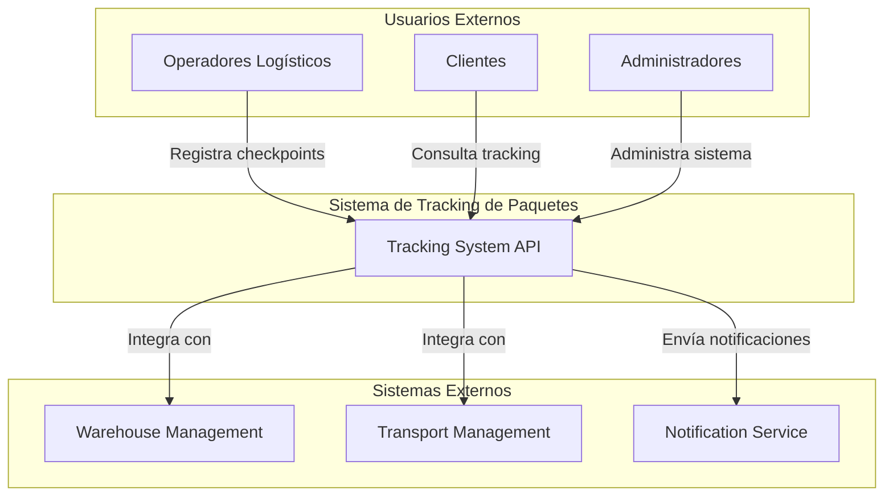
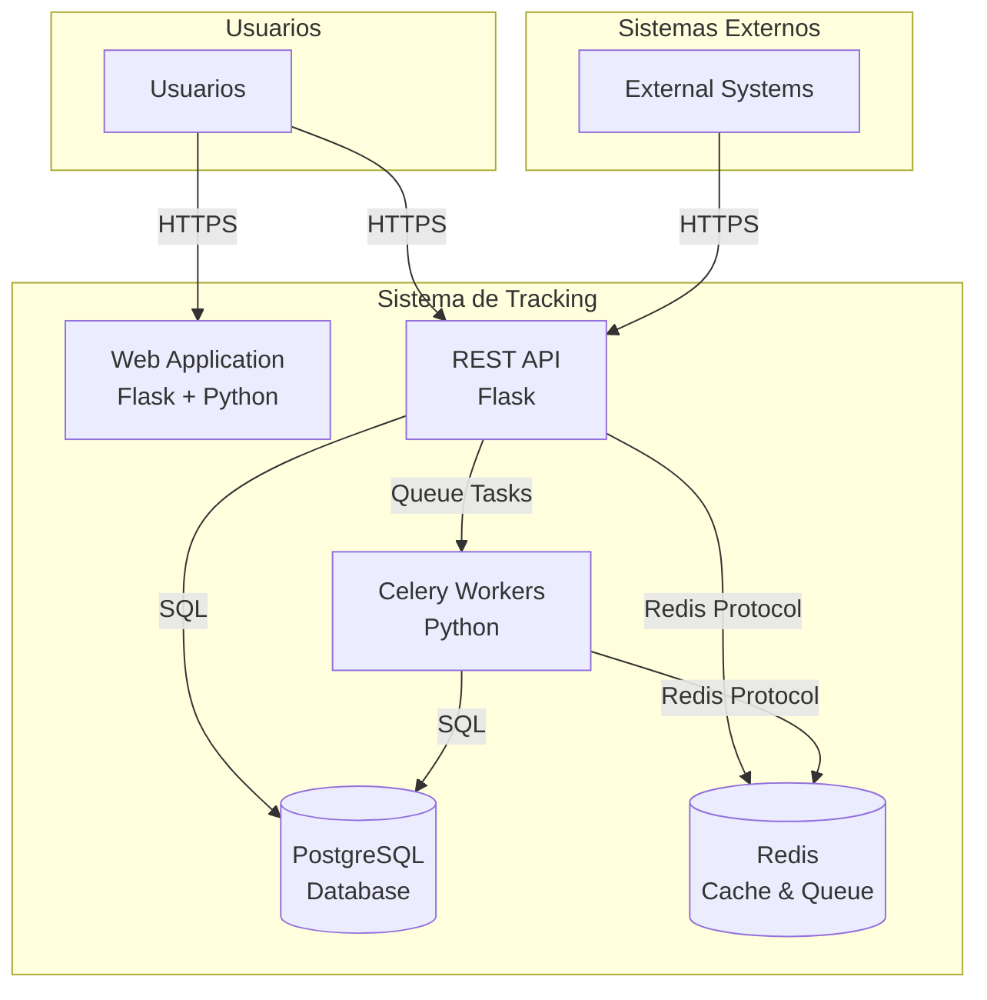
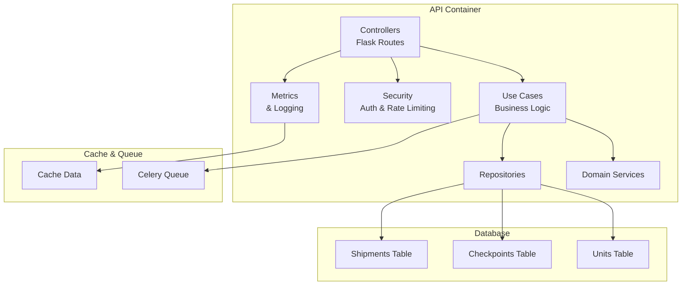
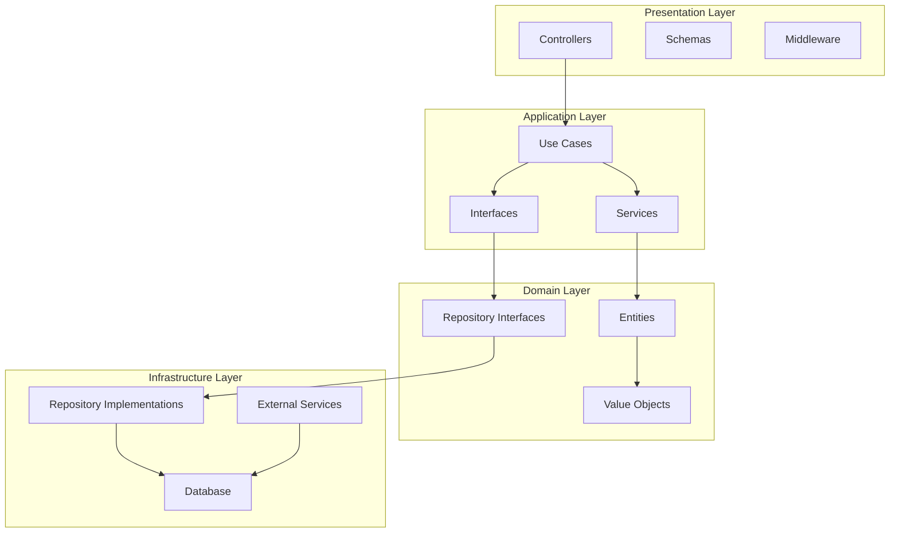

# Arquitectura del Sistema de Tracking

## Diagrama C4 - Nivel 1: Contexto del Sistema

## Diagrama C4 - Nivel 2: Contenedores

## Diagrama C4 - Nivel 3: Componentes

## Diagrama C4 - Nivel 4: Código (Clean Architecture)

## Decisiones Arquitectónicas

### 1. Clean Architecture
**Decisión**: Implementar Clean Architecture con separación clara de capas.

**Justificación**:
- Mantenibilidad y testabilidad
- Independencia de frameworks
- Facilita cambios en infraestructura
- Cumple con principios SOLID

### 2. PostgreSQL como Base de Datos Principal
**Decisión**: Usar PostgreSQL para persistencia de datos.

**Justificación**:
- ACID compliance para transacciones críticas
- Escalabilidad horizontal y vertical
- Soporte robusto para consultas complejas
- Compatibilidad con SQLAlchemy

### 3. Redis para Cache y Cola de Tareas
**Decisión**: Usar Redis para cache y cola de mensajes de Celery.

**Justificación**:
- Alto rendimiento para operaciones de cache
- Cola de tareas asíncronas confiable
- Persistencia opcional
- Escalabilidad horizontal

### 4. Celery para Tareas Asíncronas
**Decisión**: Implementar Celery para procesamiento asíncrono.

**Justificación**:
- Procesamiento de checkpoints en background
- Escalabilidad de workers
- Retry automático de tareas fallidas
- Monitoreo de tareas

### 5. API REST con Autenticación por API Key
**Decisión**: Implementar API REST con autenticación por API Key.

**Justificación**:
- Simplicidad de implementación
- Rate limiting por API key
- Seguridad adecuada para el contexto
- Fácil integración con sistemas externos

### 6. Logging Estructurado con structlog
**Decisión**: Usar structlog para logging estructurado.

**Justificación**:
- Facilita análisis de logs
- Integración con sistemas de monitoreo
- Performance optimizado
- Formato JSON para parsing

### 7. Métricas Simples sin Prometheus
**Decisión**: Implementar métricas básicas sin dependencias externas.

**Justificación**:
- Simplicidad para el MVP
- Menos complejidad operacional
- Logging estructurado suficiente
- Fácil de mantener

## Flujo de Datos Principal

### Registro de Checkpoint
1. Cliente envía POST /api/v1/checkpoints
2. Middleware valida API key y rate limiting
3. Controller valida datos de entrada
4. Use Case ejecuta lógica de negocio
5. Repository persiste en base de datos
6. Tarea asíncrona se encola en Celery
7. Response se envía al cliente

### Consulta de Tracking
1. Cliente envía GET /api/v1/tracking/{id}
2. Middleware valida API key
3. Controller extrae tracking ID
4. Use Case busca datos en repositorio
5. Repository consulta base de datos
6. Response con historial se envía al cliente

## Consideraciones de Escalabilidad

### Horizontal
- Múltiples instancias de API con load balancer
- Workers de Celery distribuidos
- Redis Cluster para alta disponibilidad
- PostgreSQL con read replicas

### Vertical
- Optimización de queries con índices
- Cache de consultas frecuentes
- Connection pooling
- Compresión de respuestas

## Monitoreo y Observabilidad

### Logs
- Logging estructurado en JSON
- Niveles de log apropiados
- Correlación de requests con trace IDs

### Métricas
- Contadores de requests por endpoint
- Tiempos de respuesta
- Errores por tipo
- Métricas de negocio (checkpoints por estado)

### Health Checks
- /health - Estado básico
- /health/detailed - Estado detallado de componentes
- /health/ready - Readiness para Kubernetes
- /health/live - Liveness para Kubernetes

