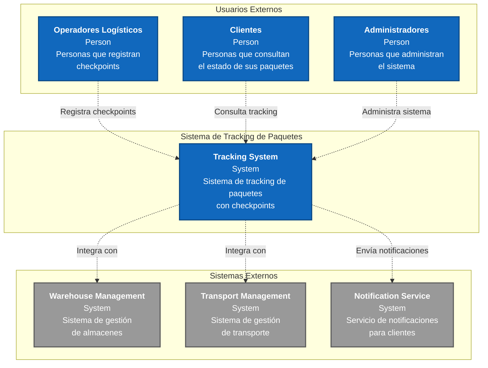
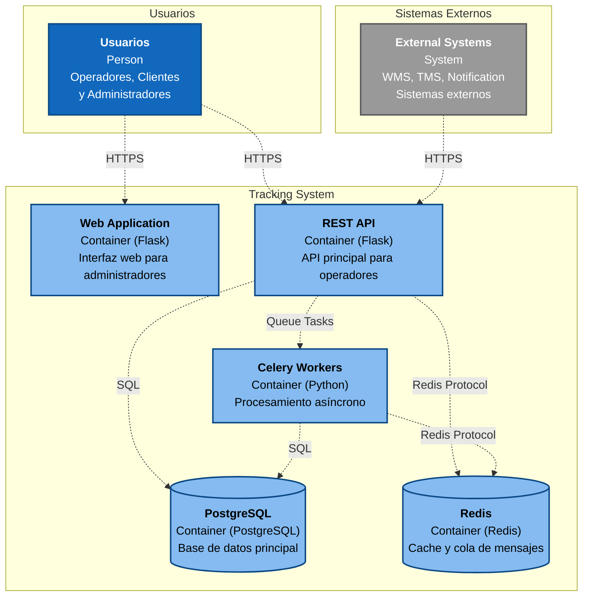
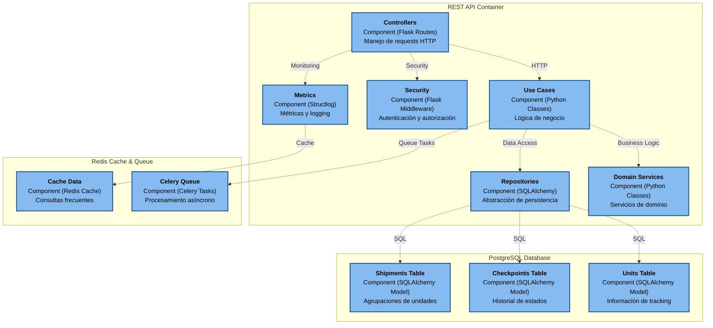
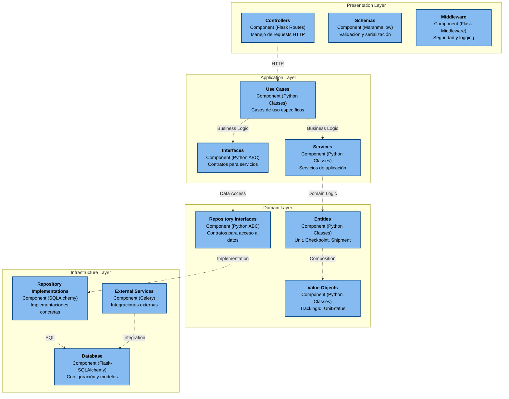
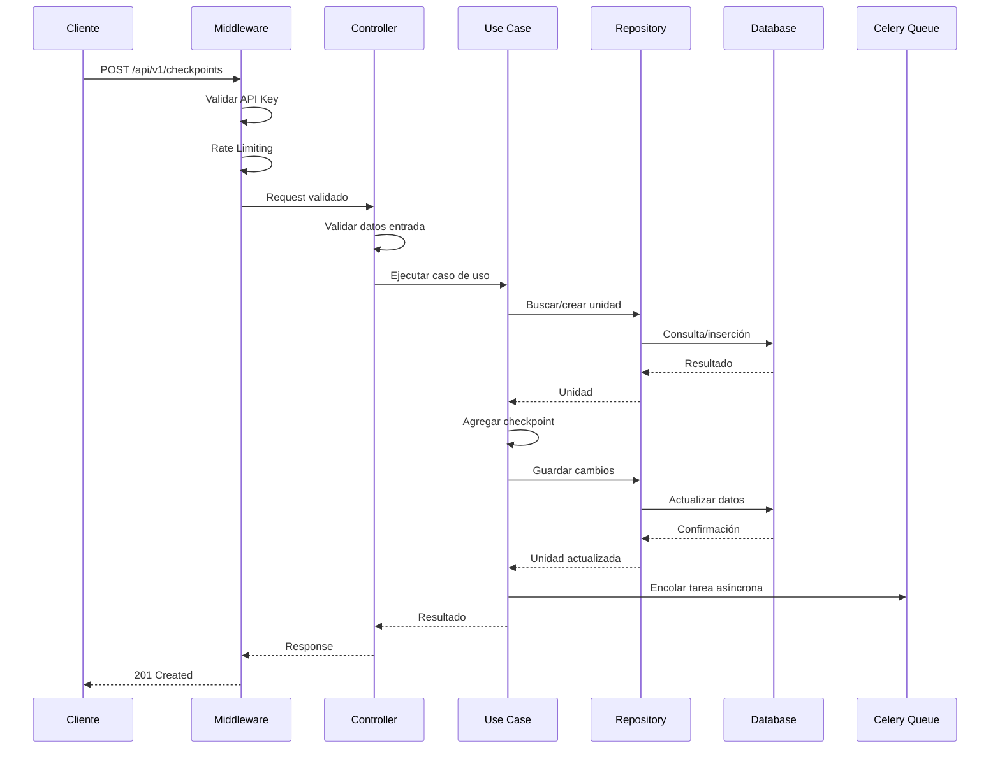
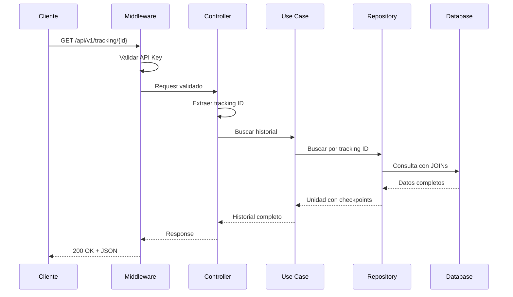

# Diagramas C4 - Sistema de Tracking de Paquetes

## Nivel 1: Contexto del Sistema

### Descripción del Contexto

**Sistema Central:**
- **Tracking System API**: El sistema principal que gestiona el tracking de paquetes

**Usuarios Externos:**
- **Operadores Logísticos**: Registran checkpoints durante el proceso logístico
- **Clientes**: Consultan el estado de sus paquetes
- **Administradores**: Gestionan y administran el sistema

**Sistemas Externos:**
- **Warehouse Management (WMS)**: Sistema de gestión de almacenes
- **Transport Management (TMS)**: Sistema de gestión de transporte
- **Notification Service**: Servicio de notificaciones para clientes

---

## Nivel 2: Contenedores

### Descripción de Contenedores

**Aplicación Web:**
- **Web Application**: Interfaz web para administradores
- **REST API**: API principal para operadores y sistemas externos
- **Celery Workers**: Procesamiento asíncrono de tareas

**Almacenamiento:**
- **PostgreSQL**: Base de datos principal para persistencia
- **Redis**: Cache y cola de mensajes para Celery

**Comunicación:**
- **HTTPS**: Comunicación segura con usuarios y sistemas externos
- **SQL**: Consultas a la base de datos
- **Redis Protocol**: Comunicación con cache y colas

---

## Nivel 3: Componentes

### Descripción de Componentes

**API Container:**
- **Controllers**: Manejan las rutas HTTP y validación de entrada
- **Use Cases**: Contienen la lógica de negocio principal
- **Domain Services**: Servicios específicos del dominio
- **Repositories**: Abstracción del acceso a datos
- **Security**: Autenticación, autorización y rate limiting
- **Metrics**: Logging estructurado y métricas

**Database:**
- **Units Table**: Almacena información de las unidades de tracking
- **Checkpoints Table**: Historial de checkpoints por unidad
- **Shipments Table**: Información de envíos y agrupaciones

**Cache & Queue:**
- **Celery Queue**: Cola de tareas asíncronas
- **Cache Data**: Cache para consultas frecuentes

---

## Nivel 4: Código (Clean Architecture)

### Descripción de Capas

**Presentation Layer:**
- **Controllers**: Manejan requests HTTP y responses
- **Schemas**: Validación y serialización de datos
- **Middleware**: Interceptores para seguridad y logging

**Application Layer:**
- **Use Cases**: Casos de uso específicos del negocio
- **Interfaces**: Contratos para servicios externos
- **Services**: Servicios de aplicación

**Domain Layer:**
- **Entities**: Entidades de negocio (Unit, Checkpoint, Shipment)
- **Value Objects**: Objetos de valor (TrackingId, UnitStatus, CheckpointData)
- **Repository Interfaces**: Contratos para acceso a datos

**Infrastructure Layer:**
- **Repository Implementations**: Implementaciones concretas de repositorios
- **Database**: Configuración y modelos de base de datos
- **External Services**: Integraciones con servicios externos

---

## Flujo de Datos Principal

### Registro de Checkpoint

### Consulta de Tracking

---

## Decisiones Arquitectónicas

### 1. Clean Architecture
**Decisión**: Implementar Clean Architecture con separación clara de capas.

**Justificación**:
- Mantenibilidad y testabilidad
- Independencia de frameworks
- Facilita cambios en infraestructura
- Cumple con principios SOLID

### 2. PostgreSQL como Base de Datos Principal
**Decisión**: Usar PostgreSQL para persistencia de datos.

**Justificación**:
- ACID compliance para transacciones críticas
- Escalabilidad horizontal y vertical
- Soporte robusto para consultas complejas
- Compatibilidad con SQLAlchemy

### 3. Redis para Cache y Cola de Tareas
**Decisión**: Usar Redis para cache y cola de mensajes de Celery.

**Justificación**:
- Alto rendimiento para operaciones de cache
- Cola de tareas asíncronas confiable
- Persistencia opcional
- Escalabilidad horizontal

### 4. Celery para Tareas Asíncronas
**Decisión**: Implementar Celery para procesamiento asíncrono.

**Justificación**:
- Procesamiento de checkpoints en background
- Escalabilidad de workers
- Retry automático de tareas fallidas
- Monitoreo de tareas

### 5. API REST con Autenticación por API Key
**Decisión**: Implementar API REST con autenticación por API Key.

**Justificación**:
- Simplicidad de implementación
- Rate limiting por API key
- Seguridad adecuada para el contexto
- Fácil integración con sistemas externos

### 6. Logging Estructurado con structlog
**Decisión**: Usar structlog para logging estructurado.

**Justificación**:
- Facilita análisis de logs
- Integración con sistemas de monitoreo
- Performance optimizado
- Formato JSON para parsing

### 7. Métricas Simples sin Prometheus
**Decisión**: Implementar métricas básicas sin dependencias externas.

**Justificación**:
- Simplicidad para el MVP
- Menos complejidad operacional
- Logging estructurado suficiente
- Fácil de mantener

---

## Consideraciones de Escalabilidad

### Escalabilidad Horizontal
- Múltiples instancias de API con load balancer
- Workers de Celery distribuidos
- Redis Cluster para alta disponibilidad
- PostgreSQL con read replicas

### Escalabilidad Vertical
- Optimización de queries con índices
- Cache de consultas frecuentes
- Connection pooling
- Compresión de respuestas

---

## Monitoreo y Observabilidad

### Logs
- Logging estructurado en JSON
- Niveles de log apropiados
- Correlación de requests con trace IDs

### Métricas
- Contadores de requests por endpoint
- Tiempos de respuesta
- Errores por tipo
- Métricas de negocio (checkpoints por estado)

### Health Checks
- `/health` - Estado básico
- `/health/detailed` - Estado detallado de componentes
- `/health/ready` - Readiness para Kubernetes
- `/health/live` - Liveness para Kubernetes
